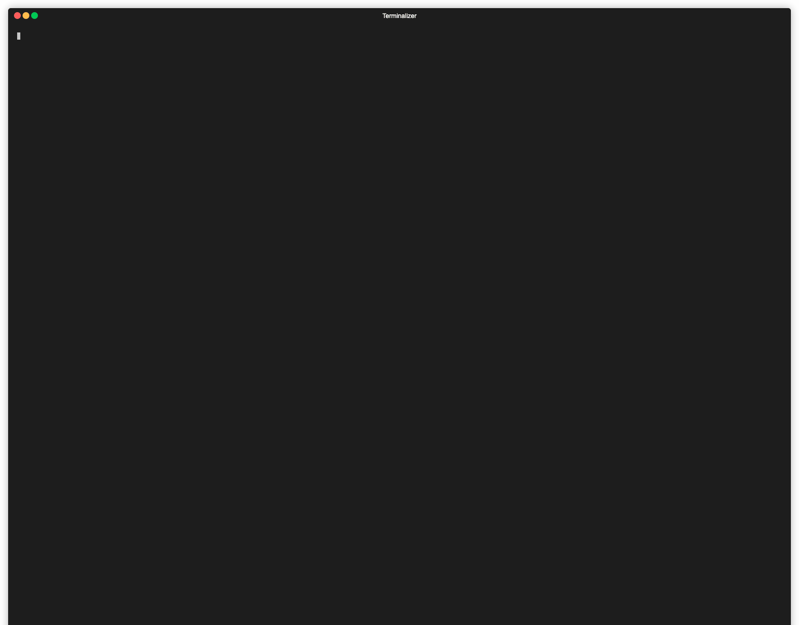

# go-exif-extract

[](https://github.com/elulcao/go-exif-extract/actions/workflows/go.yaml)
[](https://github.com/elulcao/go-exif-extract/actions/workflows/codeql-analysis.yaml)

---

<p
    align="center">
    
</p>

---

## Summary

`go-exif-extract` is a CLI tool that extracts EXIF data, location, from images (JPG) and outputs
them in a CSV format. The CLI includes a flag to specify the output file path and optional flags
to save the ouput in simple HTML format.

## Usage

```bash
go-exif-extract extract [flags] <path>
```

### Flags

| Flag       | Description            | Default         |
| ---------- | ---------------------- | --------------- |
| `--dir`    | Images path            | -               |
| `--subdir` | Include subdirectories | `false`         |
| `--output` | Output file path       | `./output.csv`  |
| `--html`   | Output HTML file path  | `./output.html` |
| `--config` | Config file path       | `~/config.yaml` |

### Config

The config file is a YAML file that contains the following fields:

```yaml
dir: <path>
html: <bool>
subdir: <bool>
output: <path>
```

Usage:

```bash
go-exif-extract extract --config <path>
```

## Compile

```bash
make build
```

## Test

```bash
make test
```

## Limitations

- Only JPG images are supported
